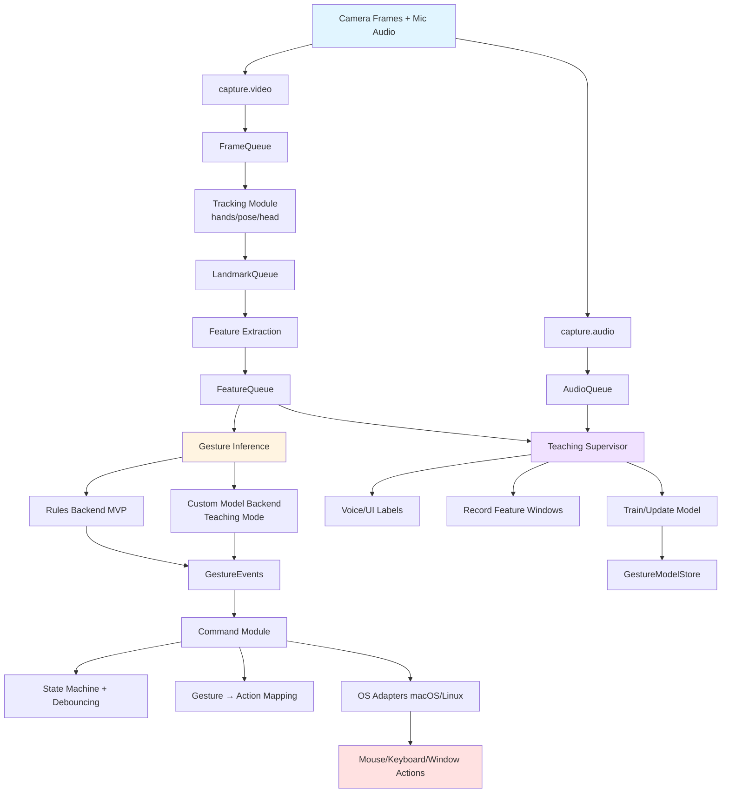

# AirDesk (or AirCursor) — Contactless Desktop Control (Hands + Head + Body)

AirDesk is a local, background-running gesture control system that lets you operate your computer without touching the mouse/keyboard. It tracks your hands via a webcam or camera, recognizes gestures, and maps them to OS actions like switching desktops, scrolling, clicking, and window management.

## Goals
- **Mobility-first:** control the screen while walking/standing.
- **Low cognitive load:** small set of reliable gestures + clear activation latch.
- **Adaptible signals** use of voice + motion signal to program your personal signals over time. 

---

## Features (Minimal Viable Product MVP)
- Real-time hand tracking (single webcam)
- Gesture toggle: enable/disable control mode via an intentional gesture
- Gesture → action mapping (YAML config or alternative suggestion)
- Actions:
  - zoom in and out (for text)
  - mouse move (general area vs specific point depending on system stability)
    - click, drag (optional)
  - scroll
  - next/previous desktop (workspace)
  - minimize / maximize / app switch (i.e. pressing windows key or F3 on mac)

## Planned
- Head/torso relative to hand to potentially determine active vs inactive hands
- Adjustable signals, potentially learned over time
  - Initially use audio + motion signal
  - Then just motion signal
- Onboarding + calibration for different users
- “Gesture combos” (temporal and physical grammar)

---

## Architecture

**Data Flow Summary:**
1. **Input Layer**: Camera frames + optional mic audio
2. **Capture Layer**: Video/audio capture → queues
3. **Tracking Layer**: MediaPipe tracking → landmarks
4. **Feature Layer**: Normalized feature vectors + time windows
5. **Inference Layer**: Rule-based or ML model → gesture events
6. **Teaching Layer**: Voice/UI labeling + model training (parallel)
7. **Command Layer**: State management + action mapping + OS execution
8. **Output Layer**: System-level mouse/keyboard/window actions

### Modules

#### Capture
- `airdesk/vision/capture.py` — webcam capture + FPS control
- `airdesk/audio/capture.py` — microphone capture (optional; for Teaching Mode voice labels)

#### Tracking + Features
- `airdesk/vision/tracking.py` — MediaPipe trackers (hands/pose/head) → landmarks
- `airdesk/vision/features.py` — landmarks → normalized feature vectors + time-window assembly

#### Gestures
- `airdesk/gestures/rules.py` — rule-based gesture detection (pinch, fist, swipe, open palm)
- `airdesk/gestures/infer.py` — unified inference interface:
  - `RulesBackend`
  - `CustomModelBackend` (trained gestures)
- `airdesk/gestures/state.py` — temporal smoothing, latch, combos, debouncing, cooldowns

#### Teaching Mode (Phase 3)
- `airdesk/teach/teacher.py` — orchestrates teach sessions (start/stop, record, commit)
- `airdesk/teach/labeling.py` — voice label parsing and/or UI label selection
- `airdesk/teach/dataset.py` — stores labeled examples (feature windows + metadata)
- `airdesk/teach/train.py` — trains/updates model (kNN/DTW → later small NN)
- `airdesk/teach/model_store.py` — loads/saves versioned models + schema

#### Actions
- `airdesk/actions/executor.py` — executes high-level actions (scroll, zoom, desktop switch)
- `airdesk/actions/mapping.py` — gesture → action mapping layer (YAML/TOML/JSON)
- `airdesk/actions/adapters/macos.py` — macOS adapter (Quartz / Accessibility APIs)
- `airdesk/actions/adapters/linux.py` — Linux adapter (uinput/evdev/xdotool backend)

#### UI (Phase 2)
- `airdesk/ui/tray.py` — tray app (toggle active mode, status, optional preview)
- `airdesk/ui/teach_panel.py` — Teaching Mode panel (label, record, save, test)

#### Core
- `airdesk/core/bus.py` — queues/events + shared runtime state
- `airdesk/core/config.py` — config loading + validation
- `airdesk/main.py` — entrypoint (tray vs headless)
- `airdesk/logging.py` — structured logging + debug toggles

---

## Tech Stack
- Python 3.11+
- OpenCV (camera capture)
- MediaPipe (hand/pose/head tracking + optional gesture recognizer)
- pynput or PyAutoGUI (input injection)
- PySide6 (system tray UI)

Notes:
- macOS requires Accessibility permissions for input control.
- Windows/Linux may require additional permissions depending on backend.

---

## Installation

See [INSTALLATION.md](INSTALLATION.md) for setup instructions.