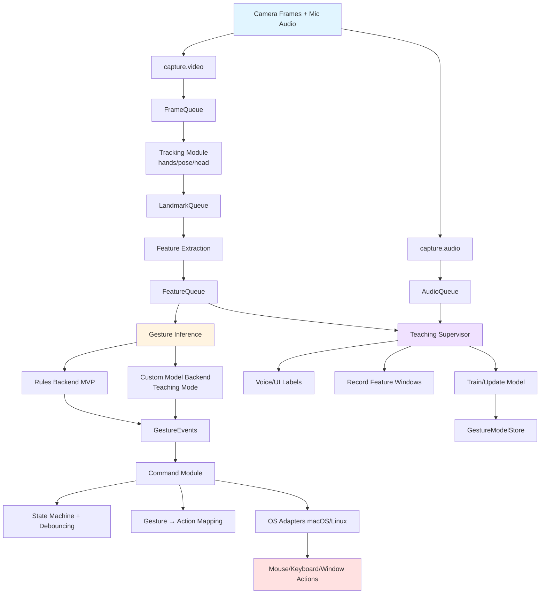

# Handsi Architecture

This document describes the internal architecture, data flow, and module organization of Handsi.

## System Architecture



### High-Level Architecture: Tauri + Python
Handsi uses a **dual-process architecture** that separates the UI from the core logic:

```
┌────────────────────────┐        ┌─────────────────────────┐
│  Tauri App (.app)      │        │  Python Backend         │
│                        │        │                         │
│  - Rust binary         │◄──────►│  - Hand tracking        │
│  - Web UI (HTML/JS)    │  IPC   │  - Gesture recognition  │
│  - Window management   │ (JSON) │  - Mouse/keyboard ctrl  │
│                        │        │  - OpenCV, MediaPipe    │
│  Size: ~10-20 MB       │        │                         │
└────────────────────────┘        └─────────────────────────┘
```

### Communication Flow

When you click "Start Detection" in the UI:

1. **JavaScript** (frontend) calls `invoke('start')`
2. **Rust** (Tauri) receives the call and sends JSON to Python via stdin:
   ```json
   {"command": "start", "args": {}}
   ```
3. **Python** reads from stdin, processes command, writes response to stdout:
   ```json
   {"success": true}
   ```
4. **Rust** reads response and returns to JavaScript
5. **JavaScript** updates UI (shows "Running", enables Stop button, starts polling status)

All communication is **JSON over stdin/stdout** (IPC = Inter-Process Communication).

---

## Data Flow Summary

1. **Input Layer**: Camera frames + optional mic audio
2. **Capture Layer**: Video/audio capture → queues
3. **Tracking Layer**: MediaPipe tracking → landmarks
4. **Feature Layer**: Normalized feature vectors + time windows
5. **Inference Layer**: Rule-based or ML model → gesture events
6. **Teaching Layer**: Voice/UI labeling + model training (parallel)
7. **Command Layer**: State management + action mapping + OS execution
8. **Output Layer**: System-level mouse/keyboard/window actions

## Modules

### Capture
- `handsi/vision/capture.py` — webcam capture + FPS control
- `handsi/audio/capture.py` — microphone capture (optional; for Teaching Mode voice labels)

### Tracking + Features
- `handsi/vision/tracking.py` — MediaPipe trackers (hands/pose/head) → landmarks
- `handsi/vision/features.py` — landmarks → normalized feature vectors + time-window assembly

### Gestures
- `handsi/gestures/rules.py` — rule-based gesture detection (pinch, fist, swipe, open palm)
- `handsi/gestures/infer.py` — unified inference interface:
  - `RulesBackend`
  - `CustomModelBackend` (trained gestures)
- `handsi/gestures/state.py` — temporal smoothing, latch, combos, debouncing, cooldowns

### Teaching Mode (Phase 3)
- `handsi/teach/teacher.py` — orchestrates teach sessions (start/stop, record, commit)
- `handsi/teach/labeling.py` — voice label parsing and/or UI label selection
- `handsi/teach/dataset.py` — stores labeled examples (feature windows + metadata)
- `handsi/teach/train.py` — trains/updates model (kNN/DTW → later small NN)
- `handsi/teach/model_store.py` — loads/saves versioned models + schema

### Actions
- `handsi/actions/executor.py` — executes high-level actions (scroll, zoom, desktop switch)
- `handsi/actions/mapping.py` — gesture → action mapping layer (YAML/TOML/JSON)
- `handsi/actions/adapters/macos.py` — macOS adapter (Quartz / Accessibility APIs)
- `handsi/actions/adapters/linux.py` — Linux adapter (uinput/evdev/xdotool backend)

### UI (Phase 2)
- `handsi/ui/tray.py` — tray app (toggle active mode, status, optional preview)
- `handsi/ui/teach_panel.py` — Teaching Mode panel (label, record, save, test)

### Core
- `handsi/core/bus.py` — queues/events + shared runtime state
- `handsi/core/config.py` — config loading + validation
- `handsi/main.py` — entrypoint (tray vs headless)
- `handsi/logging.py` — structured logging + debug toggles

## Tech Stack

- **Python 3.11+**
- **OpenCV** — camera capture
- **MediaPipe** — hand/pose/head tracking + optional gesture recognizer
- **pynput or PyAutoGUI** — input injection
- **PySide6** — system tray UI

### Platform Notes

- **macOS**: Requires Accessibility permissions for input control
- **Windows/Linux**: May require additional permissions depending on backend
