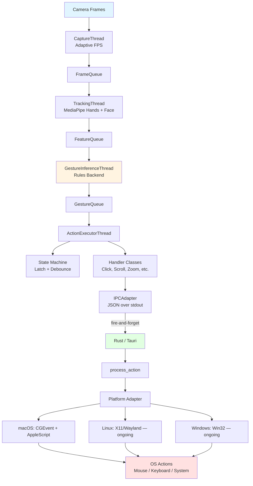

# Handsi Architecture

This document describes the internal architecture, data flow, and module organization of Handsi.

---

## System Architecture



### High-Level Architecture: Tauri + Python

Handsi uses a **dual-process architecture** that separates the UI and action execution from the vision pipeline:

```
┌──────────────────────────────┐        ┌──────────────────────────────┐
│  Tauri App (Rust)            │        │  Python Backend              │
│                              │        │                              │
│  - Desktop UI (WebView)      │◄──────►│  - Webcam capture (OpenCV)   │
│  - Action execution          │  IPC   │  - Hand/face tracking        │
│    (CGEvent, Win32, X11)     │ (JSON  │    (MediaPipe)               │
│  - Platform adapters         │  over  │  - Gesture inference         │
│  - Window management         │ stdio) │  - State machine + handlers  │
│  - Settings management       │        │  - Action handler logic      │
│                              │        │                              │
└──────────────────────────────┘        └──────────────────────────────┘
```

**Python** owns the full vision/gesture pipeline. When an action needs to execute, it sends a fire-and-forget JSON message to **Rust** via stdout. Rust routes it to the platform-specific adapter.

### Communication Flow

When you click "Start Detection" in the UI:

1. **JavaScript** (frontend) calls `invoke('start')`
2. **Rust** (Tauri) sends JSON to Python via stdin:
   ```json
   {"command": "start", "args": {}, "request_id": "123-start"}
   ```
3. **Python** processes the command, starts threads, writes response to stdout:
   ```json
   {"success": true, "data": {"status": "running"}, "request_id": "123-start"}
   ```
4. **Rust** reads response and returns to JavaScript
5. **JavaScript** updates UI (shows "Running", enables Stop button)

When a gesture triggers an action:

1. **Python** action handler calls `adapter.click()` (or similar)
2. **IPCAdapter** writes to stdout:
   ```json
   {"type": "action", "action": "click_normalized", "button": 0}
   ```
3. **Rust** reads this on its stdout-listener thread
4. **Rust** calls `process_action()` → routes to platform adapter
5. **Platform adapter** executes the OS-level action (e.g., CGEventPost on macOS)

All communication is **JSON over stdin/stdout** (IPC = Inter-Process Communication).

---

## Data Flow Summary

```
Camera Frame
    ↓
CaptureThread (adaptive FPS: 2–60 Hz)
    ↓ FrameQueue (max 2, drop on overflow)
TrackingThread (MediaPipe Hands + optional Face/Pose)
    ↓ FeatureQueue (max 5)
GestureInferenceThread (rule-based detection + temporal smoothing)
    ↓ GestureQueue (max 10)
ActionExecutorThread
    ├── State machine (latch, debounce, cooldown)
    ├── Gesture → Action mapping (from config)
    ├── Handler lifecycle (start → continue → end)
    └── IPCAdapter → JSON to Rust
             ↓
Rust process_action() → Platform Adapter → OS Action
```

### Data Flow Layers

1. **Capture Layer**: Camera frames → `FrameQueue`
2. **Tracking Layer**: MediaPipe landmarks + feature extraction → `FeatureQueue`
3. **Inference Layer**: Rule-based gesture detection + smoothing → `GestureQueue`
4. **Action Layer**: State machine + handler classes → IPC to Rust
5. **Execution Layer**: Rust platform adapter → OS-level actions (mouse, keyboard, system)

---

## Modules

### Core (`src/handsi/core/`)

| File | Purpose |
|------|---------|
| `bus.py` | `RuntimeState` (shared state with RLock), queue definitions, `GestureEvent` dataclass |
| `config.py` | Pydantic config models, YAML loading/validation (`CameraConfig`, `TrackingConfig`, `GestureConfig`, `ActionConfig`, etc.) |
| `logging.py` | Structured logging with error code prefixes (CAP, TRK, FEA, GES, ACT, GUI, CFG, ALT) |
| `types.py` | `ActionName` enum (type-safe action identifiers), `GestureMetadata` TypedDict |
| `registry.py` | Master lists: `AVAILABLE_GESTURES` and `AVAILABLE_ACTIONS` |
| `utils.py` | Path resolution, general utilities |
| `camera_utils.py` | Camera enumeration and selection helpers |

### Vision (`src/handsi/vision/`)

| File | Purpose |
|------|---------|
| `capture.py` | `CaptureThread` — webcam capture with adaptive FPS, frame-skipping backpressure |
| `tracking.py` | `TrackingThread` — MediaPipe Hands (+ optional face/pose for holistic mode), inline feature extraction, activity level updates |

### Gestures (`src/handsi/gestures/`)

| File | Purpose |
|------|---------|
| `rules.py` | `GestureDetector` — rule-based detection using hand landmark geometry. Detects pinch, fist, open hand, swipe, thumbs up/down, two-hand gestures, facial contact. All distances normalized to hand scale. |
| `infer.py` | `GestureInferenceThread` — pops features, runs detection, pushes to gesture queue. Only detects gestures with configured action mappings. |
| `smoothing.py` | Temporal smoothing — sliding-window averaging to confirm gestures across frames |

### Actions (`src/handsi/actions/`)

| File | Purpose |
|------|---------|
| `executor.py` | `ActionExecutorThread` — main orchestrator. Gesture lifecycle (start/continue/end), delegates to handlers. |
| `state_machine.py` | `GestureStateMachine` — latch control (enable/disable gesture recognition), debouncing, cooldowns |
| `interpolation.py` | `CursorInterpolator` — background thread for smooth 60 Hz cursor movement |
| `momentum.py` | `ScrollMomentum` — background thread for kinetic scrolling after gesture release |
| `continuous_tracker.py` | Tracking utilities for continuous gesture state |

**Handlers** (`src/handsi/actions/handlers/`):

| File | Handlers |
|------|----------|
| `base.py` | `ActionHandler` (ABC), `DiscreteActionHandler`, `ContinuousActionHandler` |
| `click.py` | `ClickHandler`, `DoubleClickHandler`, `RightClickHandler` |
| `mouse.py` | `MouseMoveHandler` |
| `scroll.py` | `ScrollStepHandler`, `ContinuousScrollHandler` |
| `zoom.py` | `ZoomStepHandler`, `ContinuousZoomHandler` |
| `volume.py` | `ContinuousVolumeHandler` |
| `tab.py` | `ContinuousTabHandler` |
| `desktop.py` | `SwitchDesktopHandler` |
| `keyboard.py` | `CopyHandler`, `PasteHandler`, `UndoHandler` |
| `latch.py` | `EnableLatchHandler`, `DisableLatchHandler` |
| `alert.py` | `CompositeAlertHandler` (visual + audio alerts for habit awareness) |

**Adapters** (`src/handsi/actions/adapters/`):

| File | Purpose |
|------|---------|
| `base.py` | `ActionAdapter` abstract base class (Python interface) |
| `ipc.py` | `IPCAdapter` — sends all actions to Rust as fire-and-forget JSON. No OS-specific code. |

### UI (`src/handsi/ui/`)

| File | Purpose |
|------|---------|
| `controller.py` | Backend controller — orchestrates thread lifecycle, handles start/stop/status |
| `ipc_server.py` | IPC command handler — reads stdin, dispatches commands, writes responses to stdout |
| `preview.py` | OpenCV debug preview window (optional `--preview` mode) |

### Teach (`src/handsi/teach/`) — ongoing

Scaffolded for Phase 3. Currently empty placeholders. Planned modules:

- `teacher.py` — orchestrate teach sessions (start/stop, record, commit)
- `labeling.py` — voice label parsing / UI label selection
- `dataset.py` — labeled examples (feature windows + metadata)
- `train.py` — train/update model (kNN/DTW → later small NN)
- `model_store.py` — load/save versioned models + schema

### Rust — Tauri App (`src-tauri/src/`)

| File | Purpose |
|------|---------|
| `main.rs` | Tauri app entry point. Spawns Python backend, manages IPC, routes actions via `process_action()`. Tauri commands: `start()`, `stop()`, `get_status()`, `get_settings()`, `update_settings()`, `get_mappings()`, etc. |
| `adapters/mod.rs` | `ActionAdapter` trait definition + `create_adapter()` factory (conditional compilation per platform) |
| `adapters/macos.rs` | macOS implementation — CGEvent for mouse/keyboard, AppleScript for system actions (volume, desktop switch), multi-monitor support |
| `adapters/linux.rs` | Linux adapter — **ongoing** (stub, all methods return `Err`) |
| `adapters/windows.rs` | Windows adapter — **ongoing** (stub, all methods return `Err`) |

### Frontend (`src/`)

| File | Purpose |
|------|---------|
| `index.html` | WebView UI entry point |
| `app.js` | Tauri frontend logic — invokes Rust commands, manages UI state |
| `styles-cad.css` | UI styling |

### Entrypoint (`src/handsi/main.py`)

- Parses CLI arguments (`--ipc stdio`, `--cli`, `--preview`, `--config`)
- IPC mode: starts `ipc_server.py` (for Tauri)
- CLI mode: starts threads directly via `controller.py`
- Signal handling (Ctrl+C → graceful shutdown)

---

## Tech Stack

### Python Backend
- **Python 3.11+**
- **OpenCV** — camera capture and debug preview
- **MediaPipe** — hand/face/pose tracking
- **NumPy** — landmark geometry calculations
- **Pydantic** — config validation
- **PyInstaller** — bundling Python as sidecar executable

### Rust Frontend
- **Tauri 2.1** — desktop application framework
- **core-graphics** (macOS) — CGEvent for input synthesis
- **serde / serde_json** — JSON serialization for IPC
- **tauri-plugin-shell** — process management

### Build Tools
- **Cargo** — Rust package manager
- **npm** — Tauri CLI runner
- **conda** — Python environment management

### Platform Notes

- **macOS**: Requires Accessibility permissions. Actions execute in the Rust process (which has TCC permission). See `docs/NOTES.md` for the permission architecture.
- **Linux** — ongoing: Will need X11/Wayland support for input synthesis, PulseAudio/ALSA for volume.
- **Windows** — ongoing: Will need Win32 `SendInput` API for input synthesis.

---

## Gesture → Action Pipeline (Complete)

```
1. Camera Frame
   ↓
2. MediaPipe Hands → 21 landmarks per hand (x, y, z)
   ↓
3. GestureDetector.detect_gestures()
   - Normalized distances (relative to hand scale)
   - Returns: (gesture_name, confidence, metadata)
   ↓
4. Temporal Smoother (sliding window averaging)
   - Confirms gesture when consistent across frames
   ↓
5. GestureEvent pushed to GestureQueue
   ↓
6. ActionExecutorThread pops event
   ↓
7. _map_gesture_to_action() → looks up config/default.yaml mappings
   - gesture_name (string) → ActionName (enum)
   ↓
8. GestureStateMachine.should_execute()
   - Checks latch state (enabled/disabled)
   - Applies debouncing (discrete actions only)
   ↓
9. Handler lifecycle:
   - on_gesture_start()  → setup (press button, set anchor, enable interpolation)
   - on_gesture_continue() → track state (update position, accumulate delta)
   - on_gesture_end()    → cleanup (release button, trigger momentum, reset)
   ↓
10. IPCAdapter sends JSON to Rust (fire-and-forget)
    {"type": "action", "action": "mouse_move_normalized", "x": 0.5, "y": 0.3}
    ↓
11. Rust process_action() → match on action string → call adapter method
    ↓
12. Platform Adapter (macOS: CGEvent, Linux: X11, Windows: Win32)
    → Coordinate conversion (normalized → pixels)
    → OS-level action execution
```

---

## Cross-Platform Architecture — ongoing

The Rust adapter trait provides a clean abstraction for platform-specific code:

```rust
pub trait ActionAdapter: Send {
    fn initialize(&mut self) -> Result<(), String>;
    fn mouse_move_normalized(&self, x: f64, y: f64) -> Result<(), String>;
    fn mouse_click_normalized(&self, x: f64, y: f64, button: u8) -> Result<(), String>;
    fn scroll(&self, dx: i32, dy: i32) -> Result<(), String>;
    fn keyboard_shortcut(&self, shortcut: &str) -> Result<(), String>;
    fn switch_desktop(&self, direction: &str) -> Result<(), String>;
    fn set_volume(&self, delta: i32) -> Result<(), String>;
    fn zoom(&self, direction: &str, step: f64) -> Result<(), String>;
    fn semantic_action(&self, name: &str) -> Result<(), String>;
    // ... plus mouse_down, mouse_up, double_click, etc.
    fn cleanup(&mut self);
}
```

The factory function selects the implementation at compile time:

```rust
pub fn create_adapter() -> Result<Box<dyn ActionAdapter>, String> {
    #[cfg(target_os = "macos")]
    { Ok(Box::new(MacOSAdapter::new())) }

    #[cfg(target_os = "linux")]
    { Ok(Box::new(LinuxAdapter::new())) }

    #[cfg(target_os = "windows")]
    { Ok(Box::new(WindowsAdapter::new())) }
}
```

| Platform | Status | Adapter | Technologies |
|----------|--------|---------|-------------|
| **macOS** | Active | `MacOSAdapter` | CGEvent, AppleScript, CoreGraphics |
| **Linux** | Ongoing | `LinuxAdapter` | Planned: X11/XTest, uinput, PulseAudio |
| **Windows** | Ongoing | `WindowsAdapter` | Planned: Win32 SendInput, COM APIs |

**Python side is fully platform-agnostic** — no changes needed for new platforms. All platform work happens in the Rust adapters.
